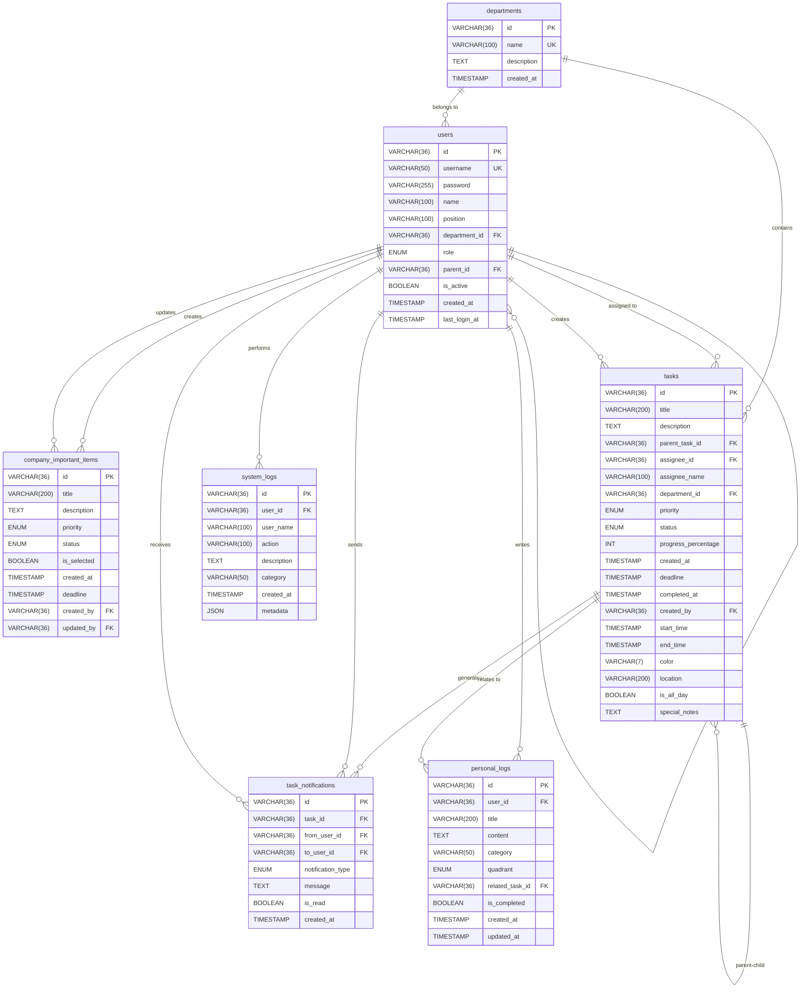
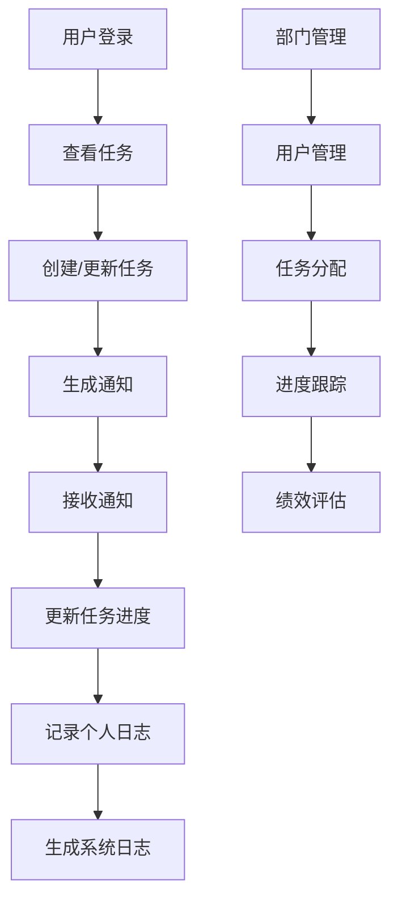
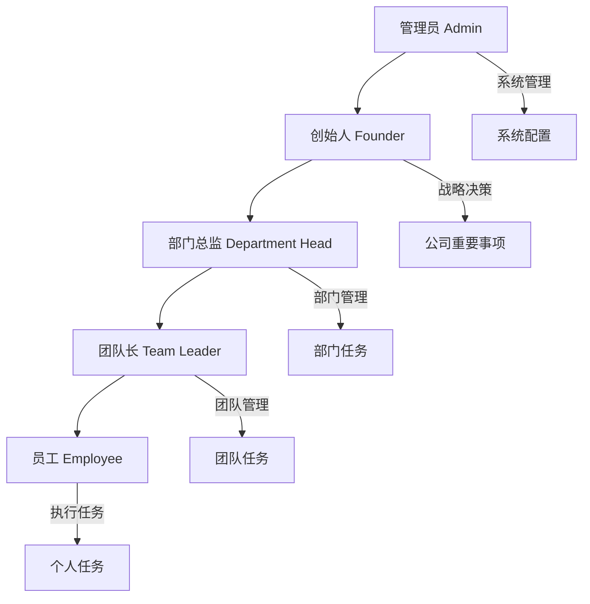
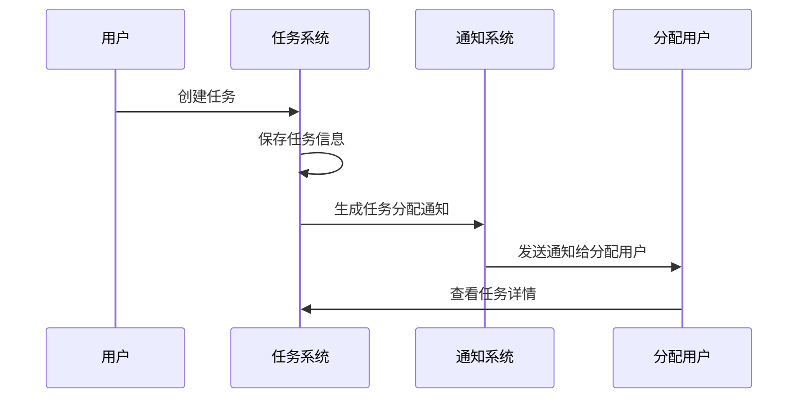
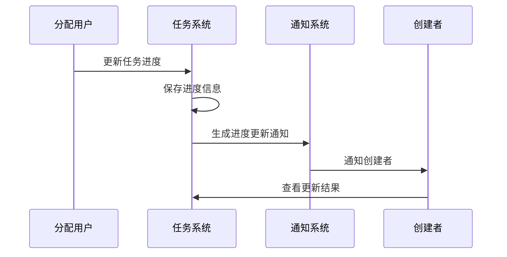

# 企业管理系统数据库实体关系图

## ER图 (Entity Relationship Diagram)

## 表关系说明

### 1. 部门与用户关系
- **一对多关系**: 一个部门可以有多个用户
- **外键**: `users.department_id` → `departments.id`

### 2. 用户层级关系
- **自引用关系**: 用户可以有上级用户
- **外键**: `users.parent_id` → `users.id`
- **层级**: 创始人 → 部门总监 → 团队长 → 员工

### 3. 用户与公司重要事项关系
- **一对多关系**: 一个用户可以创建多个重要事项
- **外键**: `company_important_items.created_by` → `users.id`
- **外键**: `company_important_items.updated_by` → `users.id`

### 4. 部门与任务关系
- **一对多关系**: 一个部门可以有多个任务
- **外键**: `tasks.department_id` → `departments.id`

### 5. 用户与任务关系
- **一对多关系**: 一个用户可以分配多个任务
- **外键**: `tasks.assignee_id` → `users.id`
- **外键**: `tasks.created_by` → `users.id`

### 6. 任务层级关系
- **自引用关系**: 任务可以有父任务
- **外键**: `tasks.parent_task_id` → `tasks.id`

### 7. 任务与通知关系
- **一对多关系**: 一个任务可以生成多个通知
- **外键**: `task_notifications.task_id` → `tasks.id`

### 8. 用户与通知关系
- **一对多关系**: 一个用户可以发送/接收多个通知
- **外键**: `task_notifications.from_user_id` → `users.id`
- **外键**: `task_notifications.to_user_id` → `users.id`

### 9. 用户与个人日志关系
- **一对多关系**: 一个用户可以写多个个人日志
- **外键**: `personal_logs.user_id` → `users.id`

### 10. 任务与个人日志关系
- **一对多关系**: 一个任务可以关联多个个人日志
- **外键**: `personal_logs.related_task_id` → `tasks.id`

### 11. 用户与系统日志关系
- **一对多关系**: 一个用户可以产生多个系统日志
- **外键**: `system_logs.user_id` → `users.id`

## 数据流向图

## 权限层级图

## 核心业务流程

### 1. 任务创建流程

### 2. 任务更新流程

这个实体关系图展示了企业管理系统完整的数据库结构和表之间的关系，支持多层级权限管理和任务分配功能。
